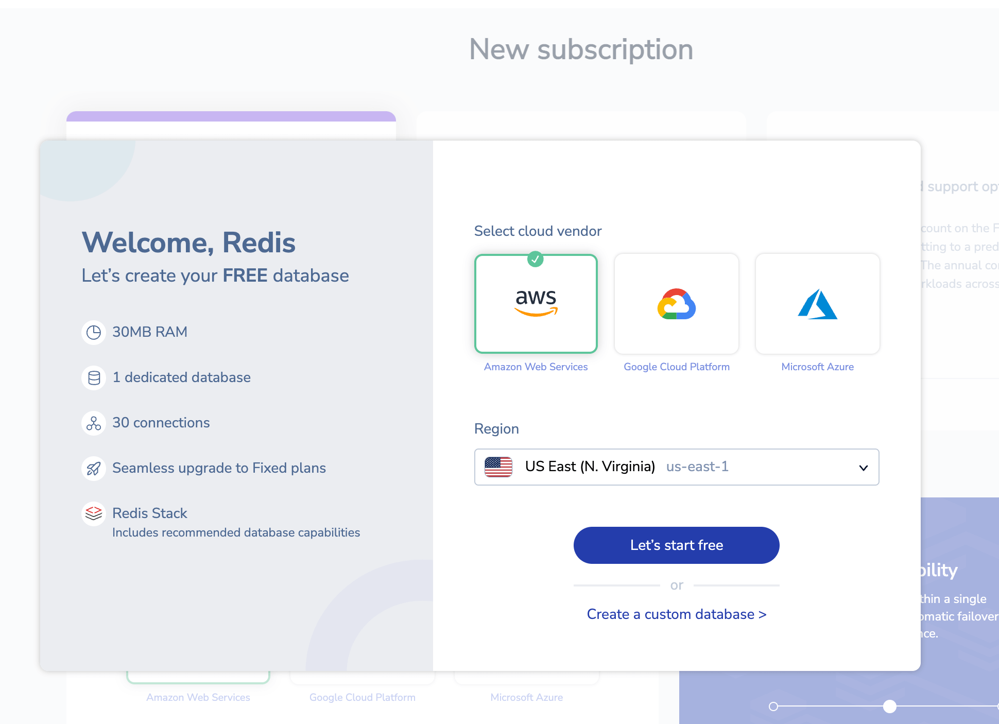
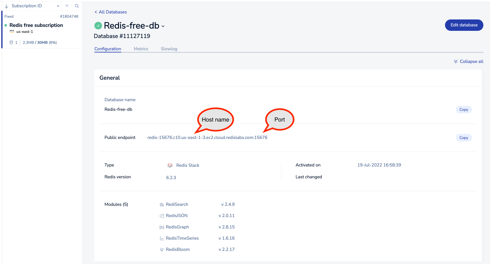
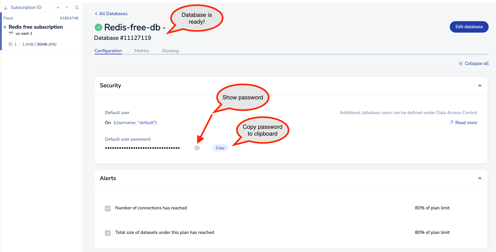

# RU102N: Redis for .NET Developers

## Introduction

Welcome! This is the course repository for the Redis University Course RU102N: Redis for .NET Developers.

To take this course you'll need the following.

1. The [.NET 7 SDK](https://dotnet.microsoft.com/en-us/download/dotnet/7.0).
2. Clone this git repository from GitHub.
3. Get a [Redis Stack](https://redis.io/docs/stack/) instance running locally or in the cloud.

There are instructions for each step below.

Throughout the course we've provided code examples written in C#. Writing and running these examples will be invaluable for those trying to learn how to use Redis from the .NET ecosystem. In order to run all these examples, you'll simply need the [.NET 7 SDK](https://dotnet.microsoft.com/en-us/download/dotnet/7.0).

## Install the .NET 7 SDK

Installation of the .NET 7 SDK is pretty self explanatory on Windows and MacOS. All you need to do is to grab the SDK installer from the [downloads page](https://dotnet.microsoft.com/en-us/download/dotnet/7.0) and run it.

## Clone the Course Git Repository

There are two ways to get a copy of the git repository on your machine.

### Option 1: Use git clone

If you have the [Git command line tools](https://git-scm.com/downloads) installed, open your command line or terminal and clone the repository like so:

```
git clone https://github.com/redislabs-training/ru102n
```

Now, change to the directory containing the course files:

```
cd ru102n
```

The remainder of these instructions assume that you are in the `ru102n` directory.

Your next step is to proceed to "Redis Setup".

### Option 2: Download a zip file from GitHub

If you don't have the command line tools for Git, you can download the zip file from the GitHub repository.


After the zip file has downloaded, simply unzip it to wherever you want to use the files from, and change directories into that folder with the command `cd ru102n`.

The remainder of these instructions assume that you are in the `ru102n` directory.

## Redis Setup

This course requires an instance of [Redis Stack](https://redis.io/docs/stack/) - an extension of Redis with loads of really neat features we'll be exploring later in this course. Redis Stack is free and available under the [Redis Source Available License (RSAL)](https://redis.com/wp-content/uploads/2019/09/redis-source-available-license.pdf). There are a variety of ways to get up and running with it. Browse the options below and see which one works best for you.

### Option 1: Redis Cloud

This option doesn't require you to run Redis locally. We provide a free tier for Redis Cloud which will be perfectly sufficient for the purposes of this course. And of course, once the course is over you're totally welcome to flush all the data from this course out and use the database in your own personal projects.

Let's get up and running with Redis Cloud:

* Navigate to the [signup page](https://redis.com/try-free?utm_medium=referral&utm_source=redisUniversity&utm_campaign=ru102n) on redis.com.
* Complete the signup form and click the "Get Started" button. Note that you can sign up with your Google or GitHub account.
* When you receive the activation email from Redis, open it and click "Activate Account".
* You'll be taken to the dashboard, and a New Subscription dialog appears:



* Select your preferred cloud provider and a preferred region (preferably one close to you!). This is where we'll host your free Redis instance.
* Click the "Let's start free" button.
* Your new free database will be created, you should see something like this:


* Click on "Redis-free-db" to drill down into the details for your instance.
* There are several things you should take a note of here that will be relevant for connecting to Redis from .NET:
    * Host name
    * Port
    * User name - this will be `default`, which means we won't actually need it to connect.
    * Password
* Your host name and port can be found in the "General" section (see example below where the host name is `redis-15676.c10.us-east-1-3.ec2.cloud.redislabs.com` and the port is `15676`).



* Scroll down to the "Security" section.
* Click the "Copy" button next to "Default user password" to copy the Redis password into the clipboard.  Paste this somewhere for safekeeping.  Alternatively, click the eye icon to show the password:



* If you see a green check mark next to the "Redis-free-db" title, your database is ready to use!

### Option 2: Docker

If you want to run Redis locally, this is the easiest way to go about it. First make sure that you've [installed Docker](https://docs.docker.com/get-docker/).

This course uses the Redis Stack Docker container. You can download and start it with the course Docker Compose as follows:

```bash
docker-compose up -d
```

You can check the status of the container with the following command:

```bash
docker ps
```

You should see an output that looks something like the following:

```
CONTAINER ID   IMAGE                      COMMAND            CREATED         STATUS        PORTS                   
                         NAMES
2dc2a8044876   redis/redis-stack:latest   "/entrypoint.sh"   3 seconds ago   Up 1 second   0.0.0.0:6379->6379/tcp, 0.0.0.0:8001->8001/tcp   redisu-ru102n
```

Leave this container running for now. When you want to stop it, use this command:

```bash
docker-compose down
```

### Option 3: Install Redis Stack

Redis Stack can be installed using popular package manager for both macOS and Linux. [Follow the instructions on redis.io](https://redis.io/docs/stack/get-started/install/) to install and start Redis Stack.

## You're Ready!

You're now ready to take the course! If you haven't already, [sign up here](https://university.redis.com/courses/ru102n/) to access the course materials.

## You're Not Alone!

If you need help or want to chat about all things Redis, [Join us on Discord](https://discord.gg/redis) and pop into the course channel!